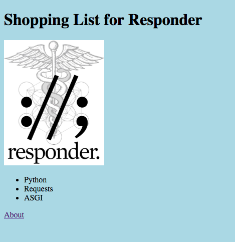
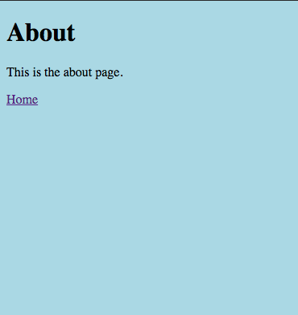

# Responder React

[](https://raw.githubusercontent.com/metakermit/responder-react/master/LICENSE) [](https://pyup.io/repos/github/metakermit/responder-react/)

The awesome new [Responder][] web framework includes great support for serving
static files, so this project shows how easy it is to integrate a [React][]
single page app.

## Features

- 🍪 quick start – create your own project in less than a minute using [cookiecutter][] (example [repo](https://github.com/metakermit/helloresponderreact) & [website](https://responder-react.herokuapp.com/))
- 🚀 quick to launch – use a "Deploy to Heroku" button in the generated _README.md_ (looks like [this](https://github.com/metakermit/helloresponderreact#deploy)) – it's magic ✨ (actually [multiple buildpacks](https://devcenter.heroku.com/articles/using-multiple-buildpacks-for-an-app) & a [custom build step](https://devcenter.heroku.com/articles/nodejs-support#heroku-specific-build-steps))
- 🐳 Docker support – get a dev environment up in no time with `docker-compose up`
- 🔨 modern JS tooling – a seamless workflow using [Parcel][]
- 🔀 frontend routing – using [React Router][] you can elegantly serve different React components on different urls
- 📻 server routing – trusted old server-side routing still works, so go ahead & build the admin interface without any JS

## Usage

You can quickly reuse the scaffolding for your own project using [cookiecutter][]:

```shell
pip install -U cookiecutter
cookiecutter gh:metakermit/responder-react # use a project name with no spaces
```

You will find further instructions in the generated project's README.md, but in short all you do is:

```shell
bin/install
bin/start
```

or

```shell
docker-compose up
```

And you'll have your Responder server serving the React app on <http://localhost:5042/>.
[React Router][] is used for the frontend routing.
To demonstrate how the app should work, it consists of two pages:

- ShoppingList running on `/`



- About running on `/about`



[responder]: http://python-responder.org/
[react]: https://reactjs.org/
[parcel]: https://parceljs.org/
[react router]: https://reacttraining.com/react-router/
[cookiecutter]: https://cookiecutter.readthedocs.io
